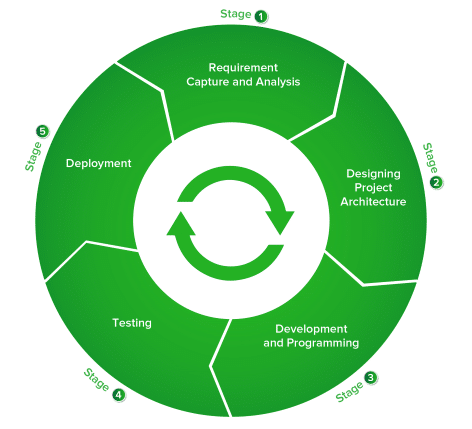

# WDC042-S02: SDLC and Branching

## Objectives
1. Appreciate software lifecycle.
2. Understand the different stages of development.
3. Use git's branching and merging to create the different development stages.
4. Apply branching on a simple portfolio.

## Lesson Proper

### Software Development Lifecycle or SDLC

**Software Development Lifecycle** or SDLC is a process that defines tasks to design, develop and test the qualities of software.



**Planning**. The planning stage is one of the most crucial part of the cycle. This is where the requirements are specified by the customer/user. Feasibility studies, market research, as well as risk assessment are also done at this stage.

**Designing**. The design stage defines the architecture and all the modules of the product along with its communication and data flow representation with the external and third party modules (if any). 

**Development**. The development stage is where the actual development happens and the product is built. Developers must follow the guidelines and tools set by the organization and this is where different development models are used.

**Testing**. The testing stage is part of all the stages in SDLC model. However, it also refers to the stage where product defects are reported, tracked, fixed and retested, until the product reaches the quality standards specified in the requirements.

**Deployment**. The deployment stage happens once the product is tested and ready to be deployed. Sometimes product deployment happens in stages and based on the feedback, the product may be released as it is or with suggested enhancements.

### Development Stages

The development stage has three main stages within that ensure proper flow and testing happens before deployment.

The three main stages are as follows:
1. **development**, where all the code production happens;
2. **quality assurance**, where testing is done for quality assurance; and
3. **production**, where the final deployable version product is kept

Each of these stages or branches are important in making sure that the production code is not tampered with any unnecessary changes that could disrupt operations.

Code production for features is done in the development branch, no other branch should have development of code as each branch has its own function.

Any feature completed in the development stage is then pushed to the QA stage. Different test suites (unit testing, regression testing, etc) are executed in this branch to ensure that the feature is error/bug free. Any issues in the feature will be reported and the issues are to be fixed in the development branch.

Once the feature passed the tests and is ready for deployment, it is now pushed to the production branch. It is in this branch that all features that are to be released to the public are located. There will be no more changes to be in the code in production and any update or new feature has to start from the development stage again.

### Branching and Merging

The different stage can be done using git's branching and merging functionalities.

#### Branch Creation 

The `git branch` command is used to create branches. The codes in each branch are independent of each other such that any change done in a branch does not appear in another branch unless it is merged.


The `git branch` command creates a copy of the master branch at that point in code creation and names it to the branch name specified.

The syntax for the branch command is `git branch <name-of-branch>`.

Instructor Note: Clone the [s01-portfolio](https://gitlab.com/zuitt-coding-bootcamp-curricula/short-courses/wdc042/wdc042-codebase/s01-portfolio) before proceeding.

```console
git init
git branch dev        // creates a branch named 'dev'
git branch staging    // creates a branch named 'staging'
git branch prod       // creates a branch named 'prod'
```

To find out what branches are available and what the current branch name is, execute `git branch`.

#### Moving Between Branches

`git checkout` is a command used to move from one branch to another.

The syntax for the branch command is `git checkout <target-branch>`.

```console
git checkout dev
git branch
git checkout staging
git branch
git checkout prod
git branch
```

Additionally, The git checkout command accepts a -b argument that acts as a convenient method which will create the new branch and immediately switch to it.

```console
git checkout -b newdev
```

This creates a new branch called `newdev` and moves to the said branch.

#### Merging Branches

Merging is Git's way of putting a forked history back together again. It makes the histories of two branches the same.

The current branch will be updated to reflect the merge, but the target branch will be completely unaffected. 

```console
git checkout <target-branch>
git merge <source-branch>
```

The merge steps will be shown in this scenario (This assumes there is are two branches called `dev` and `staging`):

1. Go to `dev` branch and create a file called `sample_merge`.

```console
git checkout dev
touch sample_merge -- or create file from text editor
```

2. Add the `sample_merge` file to the commit history of `dev` branch.

```console
git add .
git commit -m "Add sample_merge"
```

3. The `sample_merge` from `dev` branch will be merged to the `staging` branch.

```console
git checkout staging
git merge dev
```

4. The file should now exist in the `staging` branch.

## Activity

Given the `s01-portfolio` project, have the students do the following:

1. In the `dev` branch, create a footer component and commit the change.
2. Merge the new component made in the `dev` branch to the `staging` branch.
3. Push all changes using `git push origin --all` command.